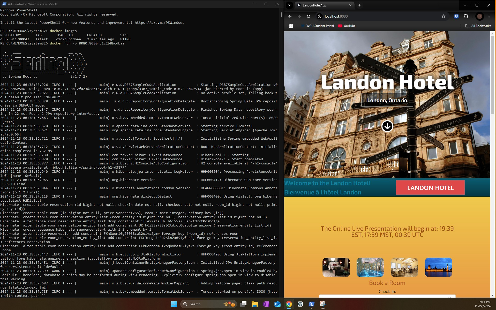
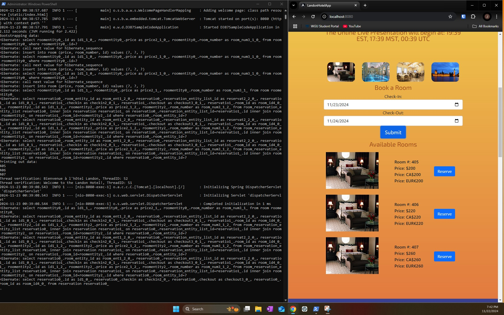

# Landon Hotel Scheduling Application (Multithreaded)

## Project Overview
The **Landon Hotel Scheduling Application** is a multi-functional web application designed for managing hotel reservations. It integrates both a **Java Spring backend** and an **Angular frontend**, offering features like localization, time zone conversion, currency display, and more. This project demonstrates advanced Java programming techniques, including multithreading and the implementation of resource bundles for internationalization and localization.

### Technologies Used:
- **Backend**: Java Spring Boot
- **Frontend**: Angular
- **Localization**: Resource bundles for English and French
- **Currency Conversion**: Displaying prices in USD, CAD, and EUR
- **Time Zones**: Conversion between Eastern Time (ET), Mountain Time (MT), and UTC
- **Containerization**: Docker

## Features
- **Multilingual Support**: Displays a welcome message in both English and French (Canada).
- **Currency Display**: Shows the price of reservations in U.S. dollars (USD), Canadian dollars (CAD), and euros (EUR).
- **Time Zone Conversion**: Displays the time for an online presentation across multiple time zones: Eastern Time (ET), Mountain Time (MT), and Coordinated Universal Time (UTC).
- **Docker Support**: A `Dockerfile` to containerize the application for easier deployment.

## How to Set Up the Project

### Prerequisites:
1. **Java 11+** (for running the backend)
2. **Node.js** and **npm** (for running the frontend)
3. **Docker** (optional, for containerization)
4. **Git** (for cloning the repository)

### Steps:

1. **Clone the Repository:**
   ```bash
   git clone https://github.com/your-username/landon-hotel.git
   cd landon-hotel
   ```

2. **Backend Setup (Spring Boot):**
   - Navigate to the backend directory:
     ```bash
     cd backend
     ```
   - Install dependencies and run the Spring Boot application:
     ```bash
     ./mvnw spring-boot:run
     ```
   - The application will be available at `http://localhost:8080`.

3. **Frontend Setup (Angular):**
   - Navigate to the frontend directory:
     ```bash
     cd frontend
     ```
   - Install the required npm packages:
     ```bash
     npm install
     ```
   - Start the Angular development server:
     ```bash
     ng serve
     ```
   - The frontend will be available at `http://localhost:4200`.

4. **Running the Application in Docker (Optional):**
   - Build the Docker image:
     ```bash
     docker build -t landon-hotel .
     ```
   - Run the Docker container:
     ```bash
     docker run -d -p 8080:8080 --name D387_studentID landon-hotel
     ```

5. **Accessing the Application:**
   - Open your browser and go to `http://localhost:8080` for the backend.
   - Open `http://localhost:4200` for the frontend.

## Project Structure

- **backend/**: Contains the Spring Boot application for the backend.
- **frontend/**: Contains the Angular application for the frontend.
- **Dockerfile**: The file for building the Docker container.
- **translations/**: Contains the resource bundles for English and French.

## Deployment to Cloud (Future Work)
The application can be deployed to cloud services like **Heroku**, **AWS**, or **Google Cloud**. Here’s a simple outline of how to deploy to **Heroku**:
1. Create a Heroku account and install the Heroku CLI.
2. Initialize a new Heroku app:
   ```bash
   heroku create
   ```
3. Push the code to Heroku:
   ```bash
   git push heroku master
   ```
4. Open the application in your browser:
   ```bash
   heroku open
   ```

For **Docker** deployment, the project can be pushed to **AWS ECS** or **Google Cloud Run**, where the containerized application can be deployed seamlessly.





